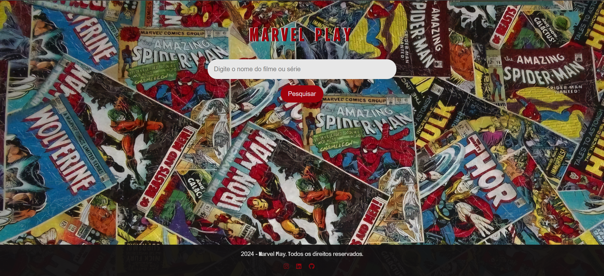

#  Marvel Play

Marvel Play é uma plataforma personalizada para encontrar seus filmes e séries favoritos da Marvel. Com uma interface intuitiva e resultados de pesquisa rápidos.

## Sumário
- [Como Funciona?](#como-funciona)
- [Tecnologias Utilizadas](#tecnologias-utilizadas)
- [Instalação](#instalação)
- [Contribuição](#contribuição)
- [Próximos Passos](#próximos-passos)
- [Contato](#contato)

### **Como Funciona?**

1. **Digite e Descubra:** Basta digitar o nome do filme, série ou personagem que você está procurando no campo de pesquisa.
2. **Resultados Instantâneos:** A ferramenta de busca inteligente vasculha um vasto banco de dados para encontrar as melhores correspondências para sua pesquisa.
3. **Explore e Descubra:** Nos resultados, irá obter uma sinopse sobre cada filme ou série, incluindo link para assistir.

### **Tecnologias Utilizadas**

* **HTML:** A estrutura básica da página, definindo os elementos como cabeçalho, conteúdo e rodapé.
* **CSS:** Responsável por estilizar a página, deixando-a com a cara da Marvel! 
* **JavaScript:** A mágica por trás da busca, manipulando o DOM (Document Object Model) para exibir os resultados de forma dinâmica.
* **Font Awesome:** Icones incríveis para deixar a sua experiência ainda mais heroica.

### **Instalação**

1. **Clone o repositório:** Use o comando `git clone https://[seu-repositorio].git` para baixar o projeto para o seu computador.
2. **Abra o arquivo index.html:** Abra o arquivo `index.html` em seu navegador para iniciar a aplicação.
3. **Comece a Pesquisar:** Digite o nome do seu herói favorito e divirta-se!

### **Contribuição**

Quer ajudar a tornar o Marvel Play ainda melhor? Sinta-se à vontade para contribuir com o projeto! 

* **Fork:** Crie uma cópia do repositório em sua própria conta.
* **Faça suas alterações:** Faça as modificações que desejar.
* **Crie um pull request:** Envie um pedido de mesclagem para que suas alterações sejam incorporadas ao projeto principal.

### **Próximos Passos**

* **Melhorias na interface:** Adicionar mais filtros, como gênero, ano de lançamento e classificação indicativa.

### **Contato**

 
  
  
  

